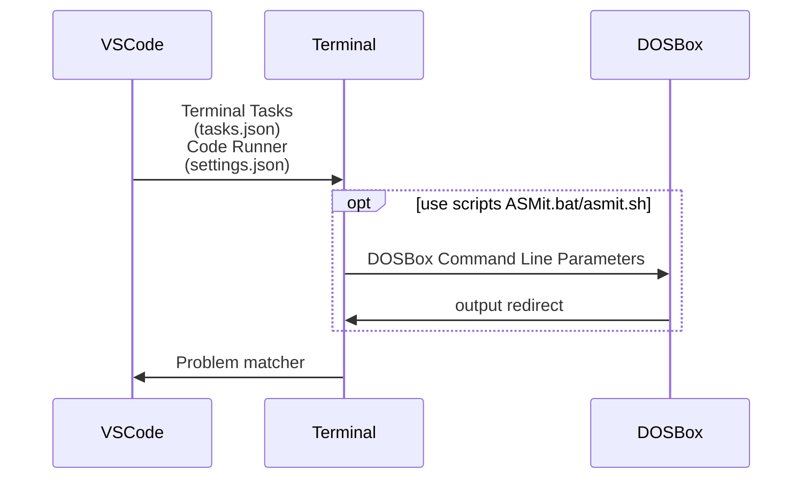

# 实现原理

## 基本原理

调用dosbox来实现模拟TASM/MASM所需要的16位环境，利用shell的参数来实现与dosbox交互。

## 详细操作步骤

0. tasks.json和Code Runner调用脚本文件实现相关功能,向脚本传递操作代号、汇编工具目录、执行目录
1. ASMit.bat/asmit.sh将需要使用的文件（VSCode当前文件）复制到工作文件夹`tools/work`
2. ASMit.bat/asmit.sh调用dosbox来进行操作
   1. 使用合适的dosbox配置文件，主要是调整窗口大小
   2. 将汇编工具`tools`挂载到dosbox中的C盘
   3. 工作文件夹`tools/work`挂载到D盘，并切换到d盘
   4. 在dosbox中启动asm.bat文件
      1. 设置path路径，来调用dosbox c盘的工具
      2. 根据输入的模式，进行不同的操作

## 模式功能对照表

分为TASM和MASM两种工具对当前文件进行汇编、链接、调试等操作，并将相关功能封装在tools/work/asm.bat中，主要功能如下

asm.bat文件有三个参数，第一个为m或者t表示使用masm还是tasm，第二个如下表，第三个如果是q那么会退出dosbox

|简记|解释|详细解释|
|--|---|----|
|r |run| 汇编、编译、运行程序|
|rr|run and redirect|run的基础上 不在dosbox中输出而是重定向到文件tools/work/中输出|
|rp|run and pause|run的基础上再pause一下|
|rd|run and debug|run的基础上再调试程序|
|d |directly debug|不进行汇编链接直接调试|

使用一下字符在VSCode、Terminal和dosbox中沟通

|模块|使用工具|操作|附加操作|
|---|---|---|---|
|0| |打开dosbox|使得可以使用汇编工具对当前文件进行操作|
|1| 使用TASM|汇编、链接、运行|停留在dosbox窗口|
|2| 使用TASM|汇编、链接、运行|运行结束后等待|
|3| 使用TASM|汇编、链接、调试||
|4| 使用TASM|直接调试||
|5| 使用masm|汇编、链接、运行|停留在dosbox窗口|
|6| 使用masm|汇编、链接、运行|运行结束后等待|
|7| 使用masm|汇编、链接、调试||
|8| 使用masm|直接调试||
|A| 使用tasm|汇编、链接、运行| 结果重定向到文件 并显示|
|B| 使用masm|汇编、链接、运行| 结果重定向到文件 并简要显示|
|C| 使用tasm|汇编、链接、运行| 结果重定向到文件 并显示|
|D| 使用masm|汇编、链接、运行| 结果重定向到文件 并简要显示|

可以在测试任务中调用以上功能