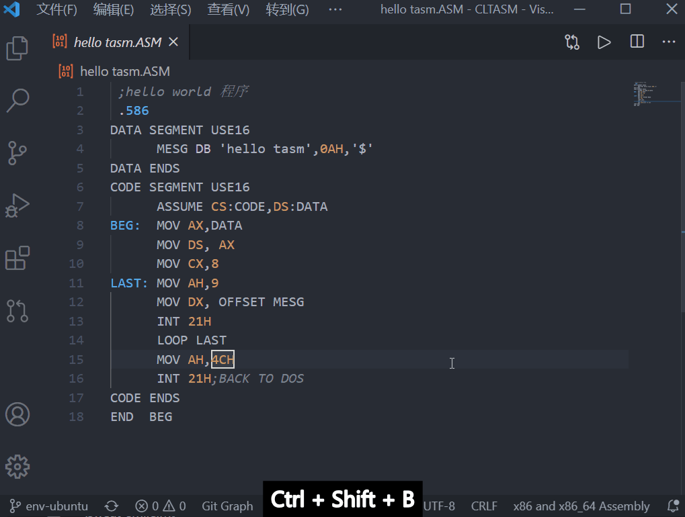
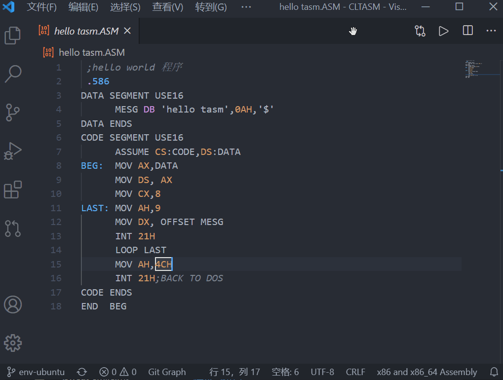
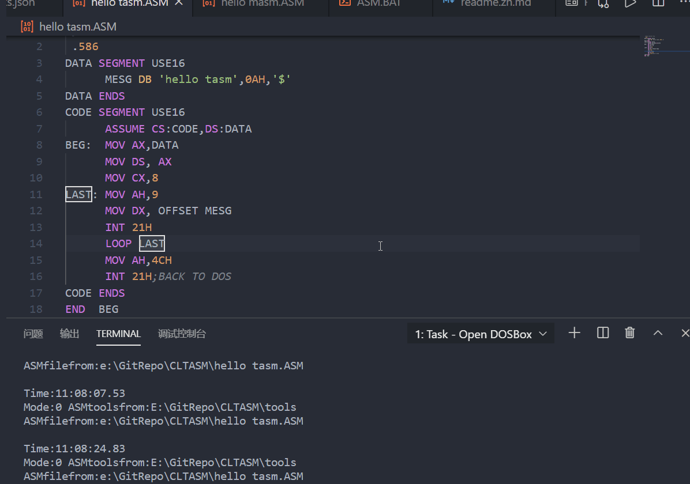
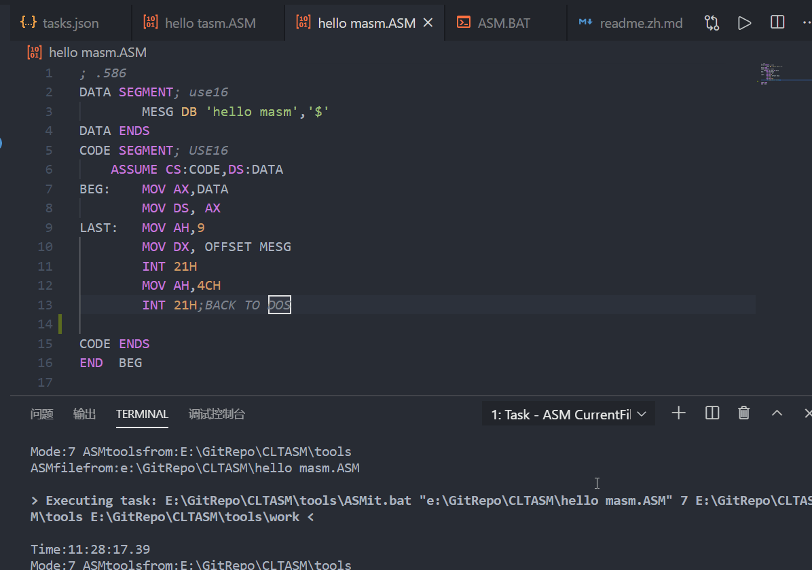
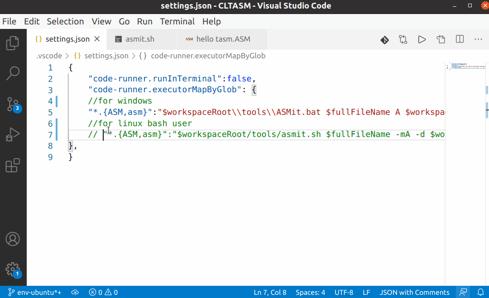

# VSCode一键调用DOSBox运行MASM/TASM代码的自定义任务

[English](readme.md)|[github仓库](https://github.com/xsro/VSC-ASMtasks)

通过配置VSCode的自定义任务来实现调用dosbox模拟16位系统实现，一键编译运行MASM/TASM代码的VSCode。已经包含需要的MASM/TASM工具集和windows下的dosbox软件。这意味着windows下只要安装了VSCode并克隆本仓库就可以实现一键编译运行等功能了。

- [本仓库的主要功能](#主要功能)
- [如何开始使用本仓库](#如何开始)
- [本仓库的文件结构](#file_folder本代码库主要内容)
- [参考链接](#point_right参考链接)
- [工作原理和主要功能表](doc/how-it-work.md)

## 主要功能

### 终端任务

#### 运行默认生成任务

按下**Ctrl+Shift+B**或者点击**终端、运行生成任务**。会提供以下四个选项。可以通过修改[tasks.json](.vscode/tasks.json)增加热键、修改功能，重新分组等等。

1. Open DOSBox  打开dosbox(并自动配置好环境)
2. TASM CurrentFile使用TASM来编译运行当前文件
3. MASM CurrentFile使用MASM来编译运行当前文件
4. ASM CurrentFile 更多操作当前文件的选项，如调试等

MASM代码文件选择`MASM CurrentFile`、TASM代码文件选择`TASM　CurrentFile`。如果编译成功，将在终端中显示结果；编译有误，则会在终端显示结果的同时，标注问题所在行。如果只是想要打开dosbox，可以点击`Open Dosbox with TASM/MASM tools added to path`，这样在dosbox中输入相关指令了。对于程序有特殊需求，比如调试等，点击`ASM CurrentFile`会有多种选择

例如一个简单的TASM代码[hello tasm](hello%20tasm.ASM)在tasm中汇编可以成功实现，在masm中汇编就会报错。如下图所示

|使用TASM编译成功|使用MASM会报错|
|------|----------|
|||

|打开DOSBox后手动输入命令调试|使用选项7来操作|
|----|---|
|||

#### 使用Code Runner插件

如果安装了Code Runner插件可以，点击右上角三角形，或者使用**Ctrl+Alt+N**.相关设置位于[.vscode/settings.json](.vscode/settings.json)。

- 使用MASM，需要将A模式改成B
- linux用户也需要进行修改，详见以下代码

```json
"code-runner.executorMapByGlob": {
    //windows用户使用TASM
    "*.{ASM,asm}":"$workspaceRoot\\tools\\ASMit.bat $fullFileName A $workspaceRoot\\tools $workspaceRoot\\tools\\work",
    //linux用户使用TASM
    "*.{ASM,asm}":"$workspaceRoot/tools/asmit.sh $fullFileName -mA -d $workspaceRoot/tools"
    //windows用户使用MASM
    "*.{ASM,asm}":"$workspaceRoot\\tools\\ASMit.bat $fullFileName B $workspaceRoot\\tools $workspaceRoot\\tools\\work",
    //linux用户使用MASM
    "*.{ASM,asm}":"$workspaceRoot/tools/asmit.sh $fullFileName -mB -d $workspaceRoot/tools"
},
```



## 如何开始

1. 克隆仓库文件
    - 直接到release中下载，解压到工作文件夹即可
    - 安装了Git可以直接克隆
2. 使用VSCode打开文件夹，[下载 VSCode](https://code.visualstudio.com/Download)
3. 然后可以在文件夹里面愉快地写代码啦

linux用户需要先安装dosbox，如使用`sudo apt install dosbox`等命令，并给脚本授权，如 `chmod u+x asmit.sh`。[github仓库](https://github.com/xsro/VSC-ASMtasks)用户可以使用该仓库作为模板创建仓库，点击`use this template`

## 总览

学习南邮《微型计算机原理与接口技术》的时候正好刚刚接触了git和VSCode，苦于DOSBox的“专注于游戏”，编辑代码种种不爽。所以尝试通过脚本和**VSCode**的终端任务来简化编译过程，实现**一键编译运行ASM文件**:smiley:

## :file_folder:本代码库主要内容

1. `.vscode`：为了在VSCode中实现汇编语言的编辑运行调试等工作增加的配置文件
   1. extensions.json:推荐了几个插件
   2. tasks.json:定义了几个任务
   3. settings.json:主要是Code Runner的配置
2. [tools](tools)文件夹
   1. dosbox:dosbox的windows程序，和扩大分辨率的配置文件
   2. TASM: 16位的TASM汇编工具，包括TASM.exe,Tlink.exe,td.exe等
   3. MASM: 16位的MASM汇编工具， 包括masm.exe,link.exe,debug.exe and others
   4. work: 包括需要在dosbox中运行的asm.bat脚本文件，同时是编译运行文件的工作文件夹
   5. ASMit.bat: 运行dosbox的bat脚本
   6. asmit.sh:  运行dosbox的bash脚本
3. hello tasm.ASM: TASM示例文件
4. hello masm.ASM: MASM示例文件

### :sparkling_heart:代码规范与协作

还有很多问题没有解决，欢迎发issue和PR。

- markdown文件使用vscode的markdownlint规范
- ASM文件还没有找到好用的规范
- 如何隐藏dosbox窗口
- 如何在不同系统中更好地使用Code Runner
- 如何适用到其他编辑器
- 如何适用到OSX

### notepad++

参考以下代码使用notepad++实现一键编译运行TASM/MASM代码文件

- `d:dos\asm\tasm\`汇编工具文件夹
- `D:\DOS\DOSBox.exe`dosbox路径

```cmd
cmd /c del d:dos\asm\tasm\t.* & copy  "$(FULL_CURRENT_PATH)" "d:dos\asm\tasm\t.asm" & D:\DOS\DOSBox.exe -noautoexec -c "mount c d:dos\asm\tasm"  -c "c:"  -c "tasm/t/zi t.asm" -c "tlink/v/3 t.obj" -c "t.exe" -c "pause" -c "exit"
```

## :point_right:参考链接

- [gitee仓库](https://gitee.com/chenliucx/CLTASM)TASM代码和微机笔记
- [vscode tasks任务的帮助文档](https://code.visualstudio.com/docs/editor/tasks#vscode)
- [vscode variables变量的帮助文档](https://code.visualstudio.com/docs/editor/variables-reference)
- [dosbox 命令行参数的文档](https://www.dosbox.com/wiki/Usage)
- [dosbox 命令文档](https://www.dosbox.com/wiki/Commands)

*Git 新手* 大家多指导呀

[^task]: 或者点击终端、运行默认生成任务(Terminal>Run Build Task)
